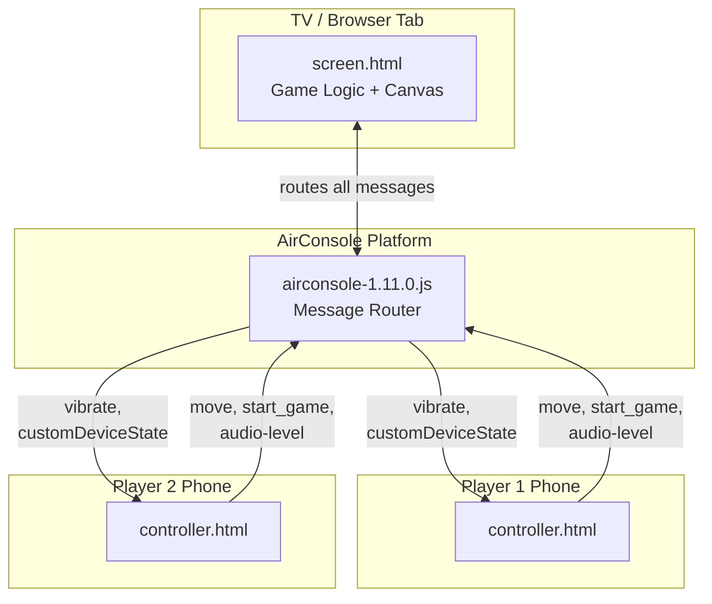
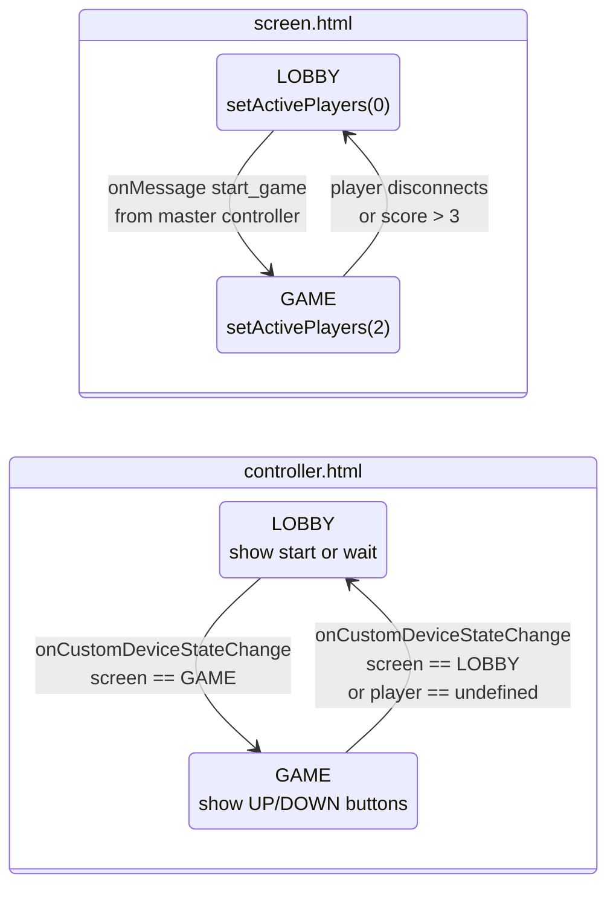
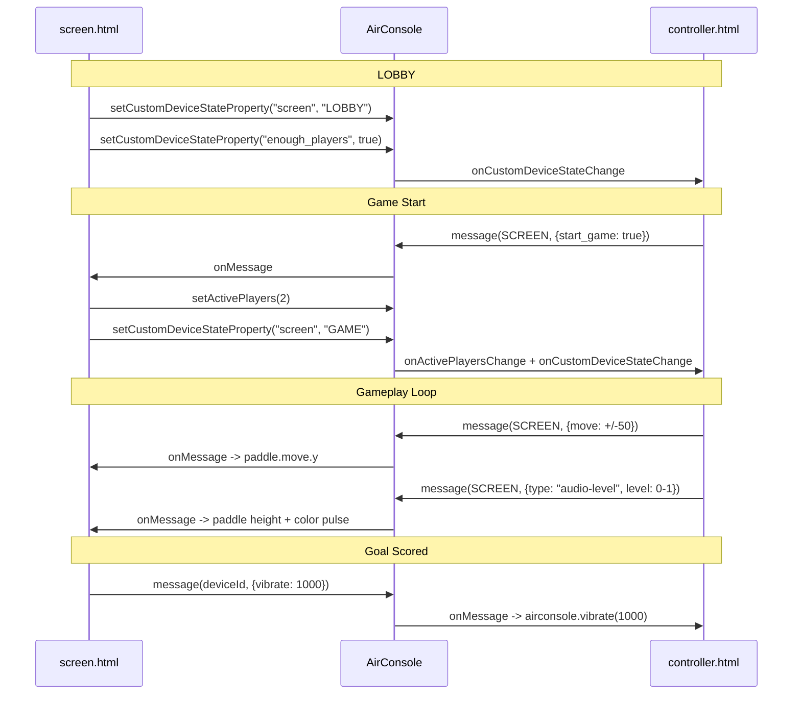
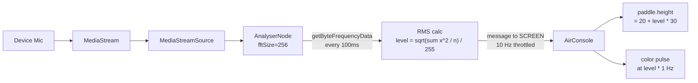

# AirConsole Pong

Minimal two-player Pong built on [AirConsole 1.11.0](https://developers.airconsole.com/). Players use their phones as controllers while the game renders on a shared TV/browser screen.

## Architecture



All communication passes through the AirConsole platform -- devices never talk directly to each other.

## Files

| File | Role |
|------|------|
| `screen.html` | TV screen. Owns game loop, canvas rendering, physics, scoring, and authoritative state. |
| `controller.html` | Phone controller. Sends input (move, start, mic audio level). Receives vibration commands. |
| `PressStart2P.ttf` | Retro pixel font used by both views. |

## Running Locally

1. Serve the directory with any static server (e.g. `python3 -m http.server 8080`)
2. Open the [AirConsole Simulator](https://www.airconsole.com/simulator/) and point it at your local URL
3. `screen.html` loads on the virtual TV; `controller.html` loads on each virtual phone

## State Machine



Key pattern: the **screen owns all state transitions**. Controllers only react to `customDeviceState` changes broadcast by the screen.

## Message Protocol



## Microphone Feature



Players can enable their microphone. Audio volume controls paddle height and triggers a color pulse effect -- louder voice = taller paddle.

## Best Practices for AirConsole Game Devs

These patterns from this example apply to any AirConsole 1.11.0 game:

### 1. Screen-Authoritative State

The screen is the single source of truth. Controllers send **intent** (move, start), never mutate game state directly. The screen broadcasts state to controllers via `setCustomDeviceStateProperty`.

```js
// screen.html -- broadcast state
airconsole.setCustomDeviceStateProperty("screen", "GAME");

// controller.html -- react to state
airconsole.onCustomDeviceStateChange = function(device_id, data) {
  if (device_id === AirConsole.SCREEN) {
    transitions[data.screen].entryAction();
  }
};
```

### 2. Initialization Guard

Without this, every reconnecting controller re-triggers lobby setup:

```js
airconsole.onConnect = function(device_id) {
  if (!initialized) {
    transitions[LOBBY].entryAction();
    initialized = true;
  }
};
```

### 3. Master Controller Pattern

Only one controller (the "master") shows the Start button. Others see a waiting message. Recalculate on connect/disconnect since master can change:

```js
if (airconsole.getMasterControllerDeviceId() === airconsole.device_id) {
  configurePrimaryController();
} else {
  configureAdditionalController();
}
```

### 4. Silence Inactive Players

Pass `silence_inactive_players: true` in the screen constructor. Combined with `setActivePlayers(2)`, spectator controllers are silenced during gameplay:

```js
airconsole = new AirConsole({ silence_inactive_players: true });
```

Controllers should check `arePlayersSilenced()` in `onReady` to avoid showing the lobby when silenced:

```js
airconsole.onReady = function() {
  if (!airconsole.arePlayersSilenced()) transitions[LOBBY].entryAction();
};
```

### 5. Message Rate Limiting

AirConsole allows ~25 messages/second per device. When sending frequent data (like audio levels from `requestAnimationFrame`), throttle explicitly:

```js
var SEND_INTERVAL_MS = 100; // 10 msg/s, well under 25/s limit
if (now - lastSendTime < SEND_INTERVAL_MS) return;
```

### 6. Delta-Time Capping

Browser tabs get suspended. Cap delta-time to prevent physics explosions on resume:

```js
delta = Math.min(20, delta); // max 20ms step
```

### 7. Clean Resource Teardown

Always disconnect AudioContext nodes, stop MediaStream tracks, and close the context on disconnect:

```js
function stopMicStream() {
  if (micSource) micSource.disconnect();
  if (micStream) micStream.getTracks().forEach(t => t.stop());
  if (micAudioContext) micAudioContext.close();
}
```

### 8. getUserMedia Error Handling

Distinguish platform errors (`AirConsoleUserMediaError`) from browser permission errors (`NotAllowedError`) to show appropriate messages.

## Known Limitations

- Ball can tunnel through paddles at high velocity (no swept collision)
- Win condition uses `> 3` (wins at 4 points) -- `>= 4` would be clearer
- View management is bare DOM manipulation; for production, see [AirConsole View Manager](https://github.com/AirConsole/airconsole-ctrl-generator-example)
